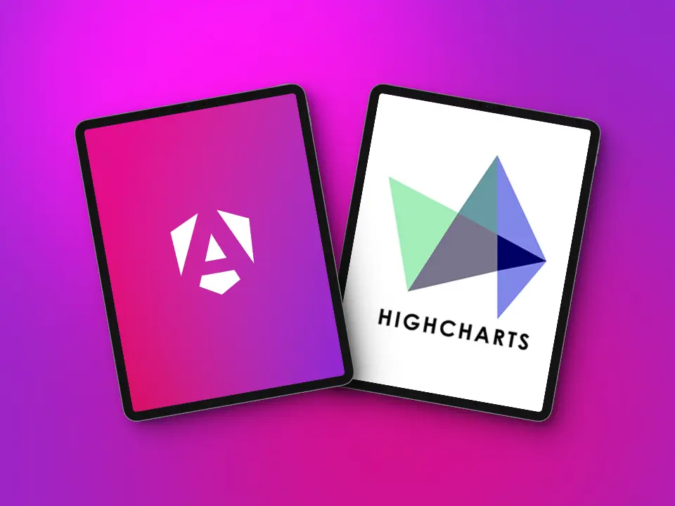
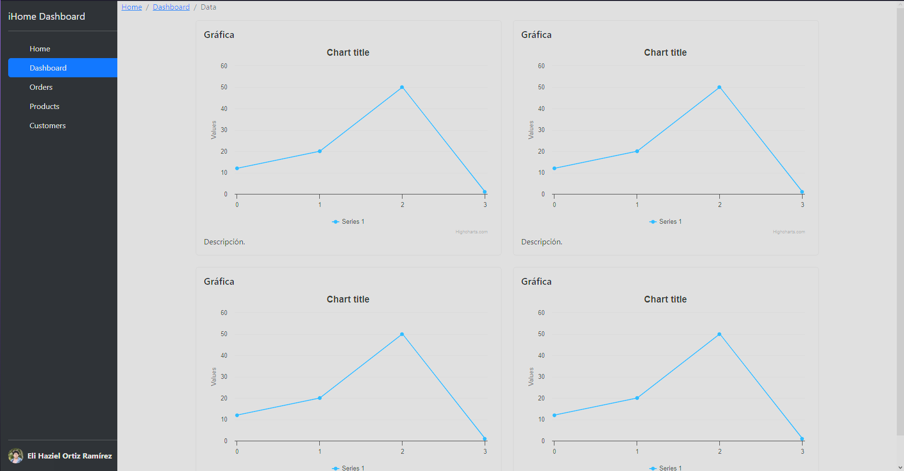
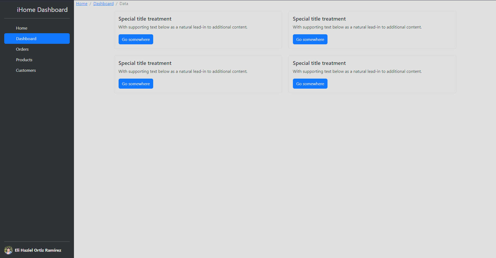

# Guía Básica Angular v17 y HighCharts

<div align="center">

  

</div>

<hr/>

## Contenido

- [Requisitos](#requisitos-previos)
- [Introducción a Angular](#introducción-a-angular)
- [Puntos a Considerar de Angular](#puntos-a-considerar-de-angular)
- [Crear un Nuevo Proyecto](#crear-un-nuevo-proyecto)
- [Ejecutar Proyecto](#ejecutar-proyecto-de-angular)
- [Estructura de un Proyecto](#estructura-de-un-proyecto)
- [Estructura de Archivos Recomendada](#estructura-de-archivos-recomendada)
- [Componentes](#componentes)
- [Recursos de Ayuda](#recursos-de-ayuda)
- [Highcharts](#highcharts)
- [Glosario](#glosario)
- [Descripción de lo realizado Lunes](#guía-del-día-lunes-15-personas-que-faltaron)
- [Autor](#autor)

<hr/>

## Requisitos Previos

- [NodeJS (^v18, recomendado: v20 LTS)](https://nodejs.org/en/download/current).
- [Angular (v17)](./docs/InstalarAngular.md).
- [Proyecto iHome API](https://github.com/Yayo22124/api-utxj-home/tree/main).
- [Visual Studio Code](https://code.visualstudio.com/download).
  - Extensiones (Recomendado crear un perfil de vscode especial para Angular):
    - [Angular Language Service](https://marketplace.visualstudio.com/items?itemName=Angular.ng-template).
    - [Angular 17 Snippets - TypeScript, Html, Angular Material, ngRx, RxJS & Flex Layout](https://marketplace.visualstudio.com/items?itemName=Mikael.Angular-BeastCode).
    - [Angular Material 2, Flex layout 1, Covalent 1 & Material icon snippets](https://marketplace.visualstudio.com/items?itemName=1tontech.angular-material).
    - [Angular Snippets (Version 16)](https://marketplace.visualstudio.com/items?itemName=johnpapa.Angular2).
    - [Paste JSON as Code](https://marketplace.visualstudio.com/items?itemName=quicktype.quicktype).
    - [Angular Essentials](https://marketplace.visualstudio.com/items?itemName=johnpapa.angular-essentials).
    - [angular2-inline](https://marketplace.visualstudio.com/items?itemName=natewallace.angular2-inline).
    - [vscode-angular-html](https://marketplace.visualstudio.com/items?itemName=ghaschel.vscode-angular-html).
    - [Tailwind CSS IntelliSense](https://marketplace.visualstudio.com/items?itemName=bradlc.vscode-tailwindcss).
    - [EditorConfig for VS Code](https://marketplace.visualstudio.com/items?itemName=EditorConfig.EditorConfig).

<hr/>

## Introducción a Angular

Angular es **full-framework** desarrollado y mantenido por **Google**, con el podemos crear aplicaciones web e interfaces web robustas de una forma más sencilla, ya que viene por defecto configurado y con varias librerías para todo tipo de fines y usos.

Sí lo comparamos con el famoso React, sabremos que Angular es un framework porque React viene mucho más limitado, siendo su objetivo ser flexible y poder ser usado con cuantas librerías externas necesites, en cambio, Angular ya trae muchas librerías propias y externas incluídas para que puedas desarrollar sin problemas.

`"La diferencia entre Framework y Libreria, es que un Framework es un conjunto de librerías."`

Angular cuenta con la gran ventaja/característica y muy valorada por las empresas, la cual es que 'obliga' a los desarrolladores a seguir una estructura escalable, robusta y una forma más estandarizada de programar, evitando problemas entre desarrolladores y código de Angular, lo que facilita entender otras aplicaciones y proyectos del mismo.

Una gran característica de Angular es que viene por defecto configurado con **TypeScript**[1] y haciendo mucho uso de conceptos de **POO** (Programación Orientada a Objetos), así como de patrones de diseño como el **Decorador**[2] o el **Singletone**[3], sobre todo los Decoradores son algo muy común, con los que se les añade funcionalidad a Clases, Objetos, Propiedades y Métodos de nuestro código.

Aprender Angular puede parecer muy díficil de aprender, sobre todo porque su curva de aprendizaje es diferente a la de React, Vue o Svelte, las cuales suelen ser mucho más fáciles al inicio, pero incrementa con el tiempo, en cambio Angular, empieza muy extensa, pero rápidamente cae. Por lo que te recomiendo que no te abrumes con el framework y verás que al final sea React, Svelte, Qwik, Astro, Solid, Vue, todos comparten la lógica y sobre todo **JavaScript**.

#### Puntos a Considerar de Angular

- **Módulos:** Angular antes de la versión 17, venía configurado para ser usado con **módulos**, una forma muy estructurada de crear aplicaciones y de separar nuestros casos de uso, pero desde su versión 15, se implementó el concepto de **Componentes Standalone**[4], separándose de los módulos, y desde la versión 16, se añadió la opción de crear aplicaciones enteras en Standalone, es decir, sin módulos, en esta versión actual (17), es la forma por defecto en la que se crean los proyectos, pero aún se mantiene la compatibilidad con los módulos.
- **Componentes**: Angular al igual que muchas librerías y frameworks frontend, permiten la creación y reutilización de Componentes, podemos pensarlos como cada parte que se repite o planea reutilizar más de una vez en nuestra aplicación, incluso el solo separar la lógica en más componentes permite hacer el código más legible.
- **Angular Material:** Es una librería oficial de Google que sigue las buenas prácticas y normativas de **Material Design** con componentes bien estructurados, diseñados, escalables y muy bien implementados para Angular. Para agregarlo al proyecto puedes seguir la siguiente [guía](https://material.angular.io/guide/getting-started).
- **TailwindCSS:** Framework de CSS la cual incluye una serie de clases preconfiguradas para aplicar estilos a nuestro HTML dentro del propio template, útil para proyectos pequeños y medianos. Para integrarse con Angular visita su [guía oficial](https://tailwindcss.com/docs/guides/angular).
- **Karma**: Es un framework popular para realizar pruebas y test a aplicaciones de JavaScript, por defecto Angular al crear un proyecto viene configurado para crear archivos llamados `spec` en los que viene una sencilla prueba para cada parte de código generada con el CLI (Puede ser desactivado con `--no-specs` o `-S` en el `ng new`).
- **RxJs**: Es una popular librería para la **Programación Reactiva**[5], Angular por defecto utiliza bastante sus conceptos y funcionalidad de los **Observables**[6] para mejorar la experiencia de desarrollo, la seguridad y sobre todo la reactividad.

<hr/>

## Crear un Nuevo Proyecto

Los proyectos de Angular son creados por medio de su herramienta de **Angular CLI**[7], con esta se nos facilita todo el proceso de creación y configuración inicial de Angular, TypeScript y el editor de código.

Angular CLI cuenta con su comando el cual es `ng`, de esta forma accedemos a la funcionalidad y comandos del CLI.

Para crear un proyecto se usa el comando `ng new MiProyecto`, donde "MiProyecto" es el nombre del proyecto, sin embargo esta forma es muy básica y es probable que el CLI pregunte algunas cosas extra como:

> [!NOTE]  
> La primera vez que usamos **ng** (Angular CLI), se nos preguntará sí queremos enviar datos de forma anónima a Google para mejorar Angular, por defecto viene marcado que no y solo es pulsar **enter**.

- Elegir un Gestor de Estilos: SASS, SCSS, CSS o LESS (Usaremos **SCSS**[8]).
- Activar o no SSR (**Server Side Rendering**[9]).

Mi recomendación es usar el siguiente comando que ya configura los pasos anteriores y lo deja como será usado durante las clases:

```bash
ng n -S --style scss --no-ssr NombreProyecto
```

Sustituyendo "NombreProyecto" por el nombre que se asocie a sus necesidades.

<hr/>

## Estructura de un Proyecto

Los proyectos tienen una estructura algo más avanzada, extensa y organizada para ser tan solo inicial, puede parecer demasiado pero no es tan díficil de entender cada archivo, en este punto trataré de explicar lo esencial.

Para comenzar, tendremos los típicos archivos de NodeJS:

- package.json: Permite tener un control y descripción del proyecto, sobre todo sí se planea subir como paquete de npm o solo describir el proyecto, así como administrar las dependencias de Desarrollo y Producción junto a sus respectivos scripts del proyecto.
- package-lock.json: Un archivo que no es recomendable modificar, puesto que es el resultado de cargar el proyecto y puede contener datos que al ser modificados corrompan el proyecto.
- node_modules: Es un directorio/carpeta que almacena todas las dependencias y código externo que usa nuestro proyecto.

Después tenemos los archivos de TypeScript:

- tsconfig.json: Este archivo contiene la configuración de typescript, cómo donde se devolverá el archivo traspilado o compilado a JavaScript, el modo de typescript y configuraciones generales.
  -tsconfig.app.json: Este archivo extiende o hereda las propiedades del anterior facilitando su edición para añadir configuraciones como alias paths.
- tsconfig.spec.ts: Archivo de configuración para los archivos de test de typescript.

Por último tenemos los archivos propios de Angular:

- angular.json: Archivo con la configuración de nuestro proyecto, no es tan común modificarlo, pero contiene características como el archivo de estilos globales, el tipo de aplicación/proyecto, el prefijo de la aplicación (por defecto app), su configuración del build y más.
- .editorconfig: Es un archivo que permite pasarle ciertas configuraciones a nuestro editor de código para que las tome en cuenta para el proyecto.
- src: Carpeta principal del código y contenido de la aplicación.
  - assets: Carpeta de archivos estáticos como imágenes, vídeos, íconos y más.
  - index.html: Archivo HTML inicial y principal de la aplicación donde se renderiza toda nuestra **SPA**[10] (Single Page Application)
  - main.ts: Es el archivo donde se construye el bootstrap de nuestra aplicación haciendo uso de app y sobre todo app.config.
  - styles.scss: Archivo de estilos globales para la aplicación.
  - favicon.ico: Ícono de Angular por defecto para la aplicación.
  - app: Módulo o componente de inicio del proyecto, por defecto generado por Angular CLI para cargar la aplicación.
    - app.component.html: Plantilla HTML del componente, es esta la que se renderizará usando los estilos y contenido del componente.
    - app.component.scss: Archivo de estilos empaquetados a nivel de componente, es decir, Angular encapsula los estilos de este archivo para solo este componente sin afectar a otros.
    - app.component.ts: Lógica y contenido del componente, aquí podemos importar y usar librerías haciendo uso de TypeScript para añadir funcionalidad.
    - app.config.ts: Este archivo contiene configuración de nuestra aplicación cómo los modulos a compartir en la aplicación, etc.. Aquí se puede proveer a los componentes módulos como el HTTPClient.
    - app.routes.ts: Este archivo contiene las rutas que usa nuestra aplicación, con este archivo podemos generar las rutas, cómo cargar los componentes, usar parámetros de rutas, etc...

<hr/>

## Estructura de Archivos Recomendada

Los proyectos de cualquier tecnología, suelen dividirse en varios directorios, archivos y módulos separados, esto para mejorar la legibilidad y experiencia de desarrollo, sobre todo a la hora del mantenimiento, ya que en el tener todo el contenido en un solo archivo, es mejor dividirlo y así repartir la carga.

Existen muchas estructuras de archivos para cada tipo de proyecto, sobre todo tomando en cuenta el tamaño del mismo, yo personalmente aprendí una para Angular, la cual hasta la fecha es la que utilizo y se usará en el proyecto, la cual consiste en generar la siguiente estructura dentro de `src/app`.

- **components**: En esta carpeta se almacenan todos nuestros componentes globales (Standalone), que desde Angular 17, todos van ahí.
- **modules** (Angular de Módulos, no el que usamos): En esta carpeta se alberga a todos nuestros módulos, intentando ser descriptivos de que hace cada uno para separar por casos de uso.
- **core**: Esta es una carpeta muy importante, en la que ponemos todo el código que queremos compartir a nivel global de nuestra aplicación y generalmente se relaciona más con funcionalidad y extras de la aplicación, la cual contiene:
  - **constants**: Aquí ponemos todas nuestras constantes como la URL de una API, expresiones regulares, valores generales, etc...
  - **services**: Cómo su nombre lo indica, aquí colocaremos nuestros **servicios**[11].
  - **interfaces**: Este directorio contiene las interfaces que usamos para tipar objetos en TypeScript.
- **pages**: Contiene los componentes que usaremos para renderizar páginas del router.

## Componentes

Para generar un componente en Angular, existen varias formas, pero explicaré las tres principales:

- Angular CLI: Usando esta herramienta con el comando `ng generate component NombreComponente` ó `ng g c NombreComponente`.
- Manualmente: Consiste en crear los archivos manualmente, obviamente es algo tardado y puede no ser muy eficiente.
- Angular Schematics: Es una extensión de VSCode, con la que podemos crear componentes usando la barra de comandos de VSCode o pulsando click derecho en el gestor de archivos y en la ruta donde lo necesitamos, yo personalmente no la suelo utilizar.

Una vez sabiendo esas formas, yo recomiendo aprender a utilizar Angular CLI, aunque pueda ser tedioso tener siempre dos terminales, una para el servidor y otra para generar componentes.

Pasando al siguiente punto, generar un componente siguiendo nuestra estructura de archivos, sería algo como lo siguiente:

```bash
ng g c components/MiComponente
```

De esta forma le decimos al CLI que genere el componente dentro de **components**.

## Ejecutar Proyecto de Angular

Una vez creado su proyecto, por defecto se instalan dependencias y se generan los archivos en un nuevo directorio/carpeta llamado igual que el nombre que se le indicó al CLI durante su ejecución.

Para ejecutar el proyecto solo hay que moverse a la carpeta generada:

```bash
cd NombreProyecto
```

Una vez dentro podemos ejecutar VScode en esa ruta o ejecutar directamente el proyecto usando el comando del CLI:

```bash
ng serve -o
```

El parámetro "-o" indica que se abrirá automáticamente en el navegador por defecto del sistema operativo.

<hr/>

## Recursos de Ayuda

- Angular CLI: [Angular CLI Overview and Command Reference](https://angular.io/cli) ó ejecutando `ng help`.
- Angular Documentación:
  - [En español (limitada)](https://docs.angular.lat/docs).
  - [En inglés (completa y recomendada)](https://angular.io/docs).
  - [Versión Nueva y Tutoriales (limitada)](https://angular.dev).
- RxJs: [Documentación](https://rxjs.dev/guide/overview).

<hr/>

## HighCharts

Existen muchas librerias para crear, manipular y mostrar gráficas en JavaScript, como Amcharts, ChartJS, o la misma HighCharts. Para este proyecto es la que se usará, aunque comparten similutedes las demás.

Esta libreria desarrollada por HighSoft, permite mostrar varios tipos de gráficas bastante personalizables y con una buena integración en Angular y TypeScript.

Puedes leer su documentación [aquí](https://www.highcharts.com/docs/index).

Trataré de hacer una pequeña guía para su instalación en Angular:

Lo primero es [instalar](https://www.highcharts.com/download/) la libreria usando nuestro gestor de paquetes, en mi caso npm:

```bash
npm install highcharts-angular
npm install highcharts
```

Una vez instalados estos paquetes, podemos usar Highcharts en algún componente, en mi caso lo haré usando `ng-content` y nuestro componente de ChartCard.

Por ahora solo para mostrar una gráfica básica, primero importaremos en nuestro componente de `ChartCard`, el módulo de Highcharts y su paquete:


```typescript
import * as Highcharts from 'highcharts';

import { Component } from '@angular/core';
import { HighchartsChartModule } from 'highcharts-angular';

@Component({
  selector: 'app-chart-card',
  standalone: true,
  imports: [HighchartsChartModule],
  templateUrl: './chart-card.component.html',
  styleUrl: './chart-card.component.scss'
})
export class ChartCardComponent {
  
}

```

Lo siguiente es instanciar nuestra gráfica y su configuración:
```typescript
import * as Highcharts from 'highcharts';

import { Component } from '@angular/core';
import { HighchartsChartModule } from 'highcharts-angular';

@Component({
  selector: 'app-chart-card',
  standalone: true,
  imports: [HighchartsChartModule],
  templateUrl: './chart-card.component.html',
  styleUrl: './chart-card.component.scss'
})
export class ChartCardComponent {
  // Instanciar nuestra gráfica ###############
  public miGrafica: typeof Highcharts = Highcharts;
  public configuracionGrafica: Highcharts.Options = {
    chart: {
      type: 'line'
    },
    series: [
      {
        type: 'line',
        data: [12,20,50,1]
      }
    ]
  }
  // Instanciar nuestra gráfica ###############
}

```

Con esto podemos pasar a mostrar en el template html nuestra gráfica básica usando la Card que teniamos previamente:
```html
<div class="w-100">
  <div class="card">
    <div class="card-body">
      <!-- Title -->
      <h5 class="card-title">Gráfica</h5>
      <!-- Chart -->
      <highcharts-chart [Highcharts]="miGrafica" [options]="configuracionGrafica" />
      <!-- Description -->
      <p class="card-text">Descripción.</p>
      <!-- Action -->
      <!-- <a href="#" class="btn btn-primary">Go somewhere</a> -->
    </div>
  </div>
</div>

```

Cómo resultado tendremos lo siguiente:

<div align="center">

  

</div>

### Guía del día Lunes 15 (Personas que Faltaron)

Durante la sesión se realizo la introducción a Angular 17, conceptos básicos repaso de esta guía y se abordaron algunos conceptos extra, puntos a considerar y se trató de explicar algunas cosas de forma más visual.

Sin embargo el código de este repositorio es lo que se ha realizado hasta el momento que consiste como indicación del profesor Marco, en generar una pequeña interfaz que simule un Dashboard del proyecto iHome, el cuál consiste en una plantilla muy sencilla conformada por:

- Sidebar
- Header (Breadcrumb)
- Contenido Principal (Main)
  - ChartCards

Todo ello componetizado y usando la dependencia de [Angular Bootstrap](https://ng-bootstrap.github.io/#/home).

Para añadir dicha dependencia, se puede utilizar el gestor de Angular CLI: `ng add @ng-bootstrap/ng-bootstrap`.

Les recomiendo estudiar y tratar de ponerse al corriente pues lo siguiente es iniciar con HighCharts.

<div align="center">

  

</div>


## Glosario

| Término                    | Definición                                                                                                                                                                                                                                                                                                                                                                                                                              |
| -------------------------- | --------------------------------------------------------------------------------------------------------------------------------------------------------------------------------------------------------------------------------------------------------------------------------------------------------------------------------------------------------------------------------------------------------------------------------------- |
| 1.- TypeScript             | Es un **superconjunto** de JavaScript con el que se le añaden característica más estrictas como el **tipado** de datos y de **POO**, con lo que permite desarrollar código más seguro de JavaScript, mostrando errores en tiempo de ejecución.                                                                                                                                                                                          |
| 2.- Decorador              | Es un patrón de diseño el cual permite dar funcionalidad y cambiar las propiedades de nuestro código de una forma más sencilla y reutilizable, esto suele aplicarse con los "**@**", también llamadas **Anotaciones**.                                                                                                                                                                                                                  |
| 3.- Singletone             | Otro patrón de diseño enfocado en seguridad y control de la información de una aplicación, en Angular se usa en sus **Servicios**, con los que podemos compartir y mantener la misma información en toda nuestra aplicación porque consiste en crear una **única instancia** de nuestra clase a nivel global.                                                                                                                           |
| 3.- Componentes Standalone | Los componentes en general, son partes de nuestra aplicación que se suelen repetir en varias partes o sitios, por lo que es bueno generalizarlos en componentes, volviendo reutilizable su código cómo un Navbar, una Card, un Button, etc... En Angular con módulos, estos están ligados a su propio módulo, pero los Standalone, son componentes que son su propio módulo por debajo y por ello pueden ser globales e independientes. |
| 5.- Programación Reactiva  | Es un paradigma de programación como la POO, pero enfocada en la escucha constante de cambios y la reactividad ante los mismos, se puede implementar con Reactive X y su librería para JavaScript: RxJs o o su nueva alternativa para Angular, NgRx.                                                                                                                                                                                    |
| 6.- Observables            | Son una característica e implementación del patrón de diseño **Observer**, la cual permite tener un flujo constante de datos y tener clientes observando los cambios del mismo, dando lugar a la programación reactiva ante dichos cambios.                                                                                                                                                                                             |
| 7.- Angular CLI            | Interfaz de línea de comandos de Angular para administrar, gestionar y manejar nuestros proyectos de Angular, con esta podemos crear proyectos nuevos, crear componentes, directivas, pipes y todo tipo de partes de Angular, así como levantar nuestros proyectos en local.                                                                                                                                                            |
| 8.- SCCS                   | Pre-Procesador de estilos de CSS y una extensión del mismo con el que podemos realizar algunas operaciones más avanzadas como el **cálculo** de medidas, por ejemplo calc(100px - 150px).                                                                                                                                                                                                                                               |
| 9.- SSR                    | Técnica moderna de crear aplicaciones de interfaz web, con las que podemos configurar un servidor el cual proporcione ciertos componentes o partes de nuestra aplicación ya renderizados o taspilados, quitando carga al cliente, mejorando la performance y la experiencia del usuario.                                                                                                                                                |
| 10.- SPA                   | Los frameworks y librerías como Angular, React o Vue, suelen generar y renderizar todo su código en un único archivo HTML (index.html), haciendo que técnicamente sean únicamente una sola página, de ahí el Single Page Application, pero esto puede disimularse renderizando componentes como páginas haciendo uso de módulos o librerías conocidad como Routers, pero no dejan de ser una sola página real.                          |
| 11.- Servicios                   | Son un patrón de diseño muy utilizado tanto en el backend como en el frontend y desarrollo en general, estos permiten almacenar lógica y funcionalidad a travéz de una interfaz bien definida, están diseñados para ser específicos. En Angular se definen como el "Único lugar de la verdad", puesto que estos son singletone y permiten la transmisión de información o alguna funcionalidad de la aplicación.                           |

<hr/>

## Autor

<table>
  <tbody>
    <tr>
      <td align="center" valign="top" width="14.28%"><a href="https://github.com/Yayo22124"><br /><sub><b>Haziel Ortiz</b></sub></a><br /></td>
  </tbody>
</table>
