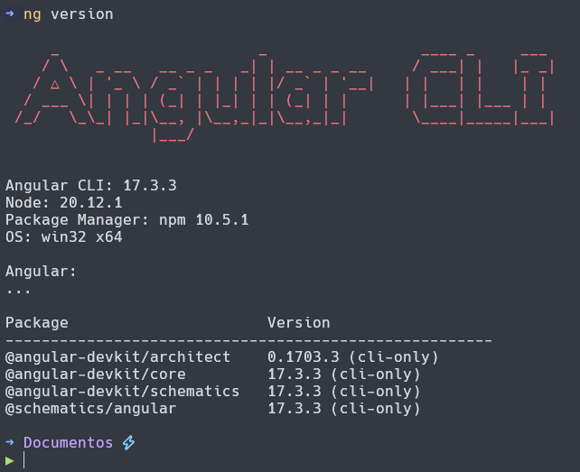

# Guía de Instalación de Angular 17

> [!IMPORTANT]  
> Es necesario contar con NodeJS en versiones superiores a la 18, puedes descargar e instalar Node desde su página [oficial](https://nodejs.org/en/download/current). Recuerda que es recomendable instalar la versión **LTS** (v20).

Para instalar el framework de Angular en su sistema, es necesario usar el gestor de paquetes de su preferencia (pnpm, npm o yarn), existen dos formas de usar Angular, lo recomendable para esta ocasión y en esta guía será la única abordada, esta es de forma **global**, sin embargo es posible no hacer este paso e instalar Angular a nivel proyecto.

## Instalar Angular CLI

Angular es un framework que cuenta con su interfaz de línea de comandos muy útil y lo más utilizado al desarrollar sus proyectos, con esta herramienta podemos modificar, crear y gestionar nuestros proyectos de Angular.

Para instalar Angular CLI es necesario ejecutar:

```bash
  npm install -G @angular/cli
```

## Comprobar Instalación

> [!NOTE]  
> Antes de usar el CLI, es necesario contar con los Scripts de la Powershell de Windows activados, para ello ejecuta una **Powershell** como **Administrador** y ejecuta **Set-ExecutionPolicy Unrestricted**.


Una vez se haya terminado la instalación podemos comprobar que esta ha resultado exitosa, podemos mostrar la versión de Angular instalada:

```bash
  ng version
```

Se nos imprimirá en la terminal las versiones de los paquetes de Angular instalados, estas deben ser v17:

<div align="center">

  

</div>


Una vez realizados estos pasos, puedes seguir con la [guía principal](../README.md).
